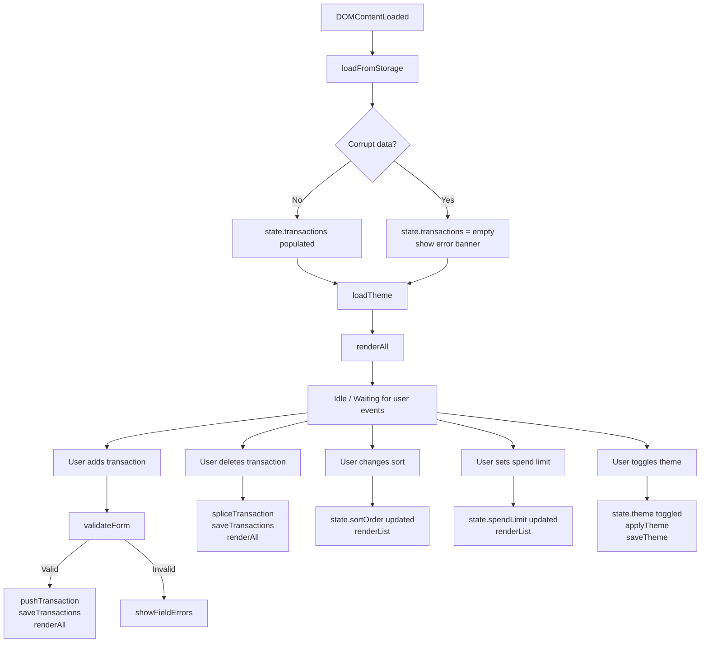

# Design Document

## Expense & Budget Visualizer

---

## Overview

The Expense & Budget Visualizer is a purely client-side single-page application (SPA) that runs entirely in the browser by opening `index.html` directly from the file system. There is no backend, no build pipeline, and no package manager. All application state lives in memory at runtime and is persisted to the browser's `localStorage` API.

The application is structured around three files:

| File | Responsibility |
|---|---|
| `index.html` | Document structure, semantic markup, CDN `<script>` tags |
| `css/style.css` | All visual styling, CSS custom properties for theming |
| `js/app.js` | All application logic, event handling, state management |

Chart.js (v4) is loaded from the `jsDelivr` CDN:
```
https://cdn.jsdelivr.net/npm/chart.js@4/dist/chart.umd.min.js
```

No other external scripts or stylesheets are used.

### Design Goals

- **Simplicity**: no abstraction layers beyond what the requirements demand.
- **Correctness**: every state mutation (add, delete, sort, highlight) is derived from a single source of truth — the in-memory `transactions` array — and then flushed to localStorage and re-rendered.
- **Speed**: all UI updates complete in well under 100 ms for ≤ 500 transactions by avoiding DOM diffing and re-rendering only the minimum required subtree.

---

## Architecture

### Module Pattern

Because the project is a single JS file with no build step, the entire `js/app.js` is wrapped in an IIFE (Immediately Invoked Function Expression) to avoid polluting the global scope:

```javascript
(function () {
  'use strict';
  // all code here
})();
```

### State Model

All mutable application state is held in a single plain object:

```javascript
const state = {
  transactions: [],   // Transaction[]  — source of truth
  sortOrder: null,    // 'amount-asc' | 'amount-desc' | 'category-az' | null
  spendLimit: null,   // number | null
  theme: 'light',     // 'light' | 'dark'
};
```

No state is duplicated. The DOM and the chart are pure projections of this object.

### Execution Flow



### Render Pipeline

`renderAll()` is the single orchestration function that calls:

1. `renderBalance()` — recalculate and display total
2. `renderList()` — build transaction rows with sort + highlight applied
3. `renderChart()` — update Chart.js data in-place

Each sub-render reads from `state` and writes to the DOM. Nothing reads from the DOM to produce state.

---

## Components and Interfaces

### HTML Structure

```
<body data-theme="light">
  <header>
    <h1>Expense & Budget Visualizer</h1>
    <button id="theme-toggle" aria-label="Toggle dark/light mode">🌙</button>
  </header>

  <main>
    <!-- Balance Display -->
    <section id="balance-section" aria-label="Total Balance">
      <p id="balance-label">Total Balance</p>
      <p id="balance-amount" class="balance">$0.00</p>
    </section>

    <!-- Input Form -->
    <section id="form-section" aria-label="Add Transaction">
      <form id="transaction-form" novalidate>
        <div class="field-group">
          <label for="item-name">Item Name</label>
          <input id="item-name" type="text" maxlength="100"
                 placeholder="e.g. Coffee" autocomplete="off" />
          <span class="error-msg" id="error-item-name" role="alert"></span>
        </div>
        <div class="field-group">
          <label for="amount">Amount ($)</label>
          <input id="amount" type="number" min="0.01" max="999999999.99"
                 step="0.01" placeholder="0.00" />
          <span class="error-msg" id="error-amount" role="alert"></span>
        </div>
        <div class="field-group">
          <label for="category">Category</label>
          <select id="category">
            <option value="">-- Select --</option>
            <option value="Food">Food</option>
            <option value="Transport">Transport</option>
            <option value="Fun">Fun</option>
          </select>
          <span class="error-msg" id="error-category" role="alert"></span>
        </div>
        <button type="submit" id="add-btn">Add Transaction</button>
      </form>
    </section>

    <!-- Controls: Sort + Spend Limit -->
    <section id="controls-section" aria-label="Controls">
      <div id="sort-group">
        <label for="sort-select">Sort by</label>
        <select id="sort-select">
          <option value="">Newest First (default)</option>
          <option value="amount-asc">Amount: Low → High</option>
          <option value="amount-desc">Amount: High → Low</option>
          <option value="category-az">Category: A → Z</option>
        </select>
      </div>
      <div id="spend-limit-group">
        <label for="spend-limit">Spend Limit ($)</label>
        <input id="spend-limit" type="number" min="0.01"
               max="999999999.99" step="0.01" placeholder="No limit" />
        <span class="error-msg" id="error-spend-limit" role="alert"></span>
      </div>
    </section>

    <!-- Transaction List -->
    <section id="list-section" aria-label="Transaction List">
      <div id="error-banner" class="error-banner hidden" role="alert"></div>
      <ul id="transaction-list" aria-live="polite"></ul>
      <p id="empty-state" class="hidden">No transactions yet. Add one above!</p>
    </section>

    <!-- Chart -->
    <section id="chart-section" aria-label="Spending Distribution">
      <h2>Spending by Category</h2>
      <div id="chart-placeholder" class="hidden">No spending data available.</div>
      <canvas id="spending-chart" role="img"
              aria-label="Pie chart of spending by category"></canvas>
    </section>
  </main>
</body>
```

### JavaScript Module Interface

All functions are private to the IIFE. The public surface is zero — nothing is exported.

#### Key Functions

| Function | Signature | Description |
|---|---|---|
| `init` | `() → void` | Entry point, called on `DOMContentLoaded` |
| `loadFromStorage` | `() → void` | Reads + validates localStorage; populates `state.transactions` |
| `saveTransactions` | `() → void` | Serialises `state.transactions` to localStorage |
| `renderAll` | `() → void` | Calls `renderBalance`, `renderList`, `renderChart` |
| `renderBalance` | `() → void` | Computes and displays total balance |
| `renderList` | `() → void` | Sorts, filters, builds `<li>` rows with highlights |
| `renderChart` | `() → void` | Updates Chart.js in-place |
| `validateForm` | `() → boolean` | Returns true if all fields pass; otherwise injects error messages |
| `addTransaction` | `(name, amount, category) → Transaction` | Constructs and pushes a Transaction to state |
| `deleteTransaction` | `(id) → void` | Removes a transaction by id from state |
| `applyTheme` | `(theme) → void` | Writes `data-theme` attribute to `<body>` and updates toggle icon |
| `getChartData` | `() → { labels, data }` | Aggregates transactions by category for chart consumption |
| `getSortedTransactions` | `() → Transaction[]` | Returns a sorted copy of `state.transactions` |
| `getCategoryTotal` | `(category) → number` | Sums amounts for a given category |

---

## Data Models

### Transaction

```javascript
/**
 * @typedef {Object} Transaction
 * @property {string}  id        - UUID v4 generated at creation time
 * @property {string}  name      - Item name (1–100 chars, trimmed)
 * @property {number}  amount    - Positive float, rounded to 2 decimal places
 * @property {string}  category  - One of: 'Food', 'Transport', 'Fun'
 * @property {number}  timestamp - Unix epoch ms (Date.now() at creation)
 */
```

**ID Generation**: `crypto.randomUUID()` is used (supported in all modern browsers). No external library is needed.

**Amount Precision**: Amounts are stored as JavaScript `number` (IEEE-754 double). To avoid floating-point accumulation errors in the balance total, all amounts are rounded to 2 decimal places at entry time using `Math.round(raw * 100) / 100`, and the balance is computed as a running sum then formatted with `.toFixed(2)`.

### Storage Schema

All transactions are stored under a single fixed key:

```
localStorage key: "ebv_transactions"
localStorage value: JSON array of Transaction objects
```

Theme preference:

```
localStorage key: "ebv_theme"
localStorage value: "light" | "dark"
```

### Validation Rules

| Field | Rule |
|---|---|
| `name` | Non-empty after `.trim()`; max 100 characters |
| `amount` | Parseable as a finite number; `0.01 ≤ amount ≤ 999_999_999.99` |
| `category` | One of `['Food', 'Transport', 'Fun']` |
| `spendLimit` | Parseable as a finite number; `0.01 ≤ limit ≤ 999_999_999.99` (optional field) |

---

## Correctness Properties

*A property is a characteristic or behavior that should hold true across all valid executions of a system — essentially, a formal statement about what the system should do. Properties serve as the bridge between human-readable specifications and machine-verifiable correctness guarantees.*

### Property 1: Transaction Storage Round-Trip

*For any* valid array of Transactions (each with a unique id, valid name, amount within range, valid category, and timestamp), serialising that array to JSON and deserialising it back SHALL produce an array of Transactions where each Transaction's `id`, `amount`, `name`, `category`, and `timestamp` fields are identical to the originals with no loss of precision.

**Validates: Requirements 5.6**

---

### Property 2: Balance Sum Correctness

*For any* non-empty array of Transactions, the displayed balance SHALL equal `-(sum of all transaction amounts)`, formatted to exactly two decimal places, matching the result of computing the same arithmetic directly on the `amount` fields.

**Validates: Requirements 3.2, 3.6**

---

### Property 3: Whitespace Names Are Rejected

*For any* string composed entirely of whitespace characters (spaces, tabs, newlines), submitting it as an item name SHALL cause the Validator to reject the form and leave the Transaction_List unchanged.

**Validates: Requirements 1.4, 1.5**

---

### Property 4: Amount Boundary Enforcement

*For any* numeric value outside the range `[0.01, 999,999,999.99]` (including zero, negative numbers, and values exceeding the maximum), submitting it as an amount SHALL cause the Validator to reject the form and leave the Transaction_List unchanged.

**Validates: Requirements 1.4, 1.5**

---

### Property 5: Sorting Stability

*For any* Transaction_List and any selected sort order, all Transactions with equal sort keys SHALL appear in descending order of their `timestamp` (most recent first) as a stable tiebreaker.

**Validates: Requirements 6.3**

---

### Property 6: Chart Aggregation

*For any* set of Transactions, the aggregate amount displayed by the Chart for a given Category SHALL equal the sum of all positive-amount Transactions belonging to that Category.

**Validates: Requirements 4.1, 4.7, 4.8**

---

### Property 7: Spend Limit Highlighting Completeness

*For any* non-null Spend_Limit and any Transaction_List, a Transaction row SHALL have the highlighted visual style applied if and only if the sum of all Transaction amounts in its Category equals or exceeds the Spend_Limit.

**Validates: Requirements 7.2, 7.4**

---

### Property 8: Sort Does Not Mutate Storage

*For any* sort order selection, the JSON representation of Transactions in `localStorage` SHALL remain identical before and after the sort operation (sort is view-only, not persisted).

**Validates: Requirements 6.2**

---

## Error Handling

### localStorage Unavailability

`localStorage` access can throw `SecurityError` (private browsing restrictions) or `QuotaExceededError` (storage full). All reads and writes are wrapped in `try/catch`:

```javascript
function saveTransactions() {
  try {
    localStorage.setItem(STORAGE_KEY, JSON.stringify(state.transactions));
  } catch (e) {
    // Silently fail — in-memory state is still valid for the current session
  }
}
```

On **read failure at init**, the app displays a visible error banner:
> "Stored data could not be loaded. Starting with an empty list."

On **write failure**, the session continues normally; no error is shown (the requirement permits silent failure for writes).

### Corrupt Data Recovery

When `JSON.parse` of the stored value throws, or when the parsed value is not an array, or when array elements fail the Transaction schema check, the app discards the corrupt data and initialises with an empty state. A banner is shown (see Req 5.5, 2.7).

Schema check for each item:

```javascript
function isValidTransaction(t) {
  return (
    t !== null &&
    typeof t === 'object' &&
    typeof t.id === 'string' &&
    typeof t.name === 'string' &&
    typeof t.amount === 'number' &&
    isFinite(t.amount) &&
    ['Food', 'Transport', 'Fun'].includes(t.category) &&
    typeof t.timestamp === 'number'
  );
}
```

If any single item in the array fails this check, the **entire** stored array is discarded to prevent partially-corrupt state.

### Form Validation Errors

Validation errors are displayed inline, adjacent to the offending field, using `<span class="error-msg" role="alert">`. Error spans are cleared on each new submit attempt before re-validation, so stale errors do not persist.

### Spend Limit Input Errors

Invalid spend limit values (non-numeric, ≤ 0, > 999,999,999.99) display an inline error and the previous valid limit is retained. If no prior valid limit existed, the limit remains `null` (no highlighting).

### Performance Guard (500 Transactions)

After every `renderList()` call, if `state.transactions.length >= 500`, a persistent warning banner is displayed:
> "Performance warning: you have 500 or more transactions. The app may slow down."

---

## Testing Strategy

### Overview

This application uses a dual testing approach:

- **Unit / example-based tests**: verify specific scenarios, edge cases, error conditions, and form validation boundaries using a lightweight test runner (no build step required — tests run in Node.js using the built-in `node:test` module, or in-browser with a script tag).
- **Property-based tests**: verify universal properties across many generated inputs using [fast-check](https://fast-check.dev/), loaded via CDN for in-browser use or installed as a dev dependency for Node.js.

### Property-Based Testing Setup

Each property test must:
- Run a minimum of **100 iterations** (fast-check default is 100; increase via `{ numRuns: 200 }` for critical properties).
- Be tagged with a comment referencing the design property it validates.
- Use fast-check arbitraries to generate Transactions, arrays, strings, and numbers.

Tag format:
```javascript
// Feature: expense-budget-visualizer, Property <N>: <property_text>
```

### Property Tests

| Test | Property | fast-check Arbitrary |
|---|---|---|
| Storage round-trip | Property 1 | `fc.array(transactionArb)` |
| Balance correctness | Property 2 | `fc.array(transactionArb, { minLength: 1 })` |
| Whitespace name rejection | Property 3 | `fc.stringMatching(/^\s+$/)` |
| Amount boundary enforcement | Property 4 | `fc.oneof(fc.float({ max: 0 }), fc.float({ min: 1e9 }))` |
| Sort stability (tie-breaking) | Property 5 | `fc.array(transactionArb)`, inject duplicate sort keys |
| Chart aggregation | Property 6 | `fc.array(transactionArb)` |
| Spend limit highlighting | Property 7 | `fc.array(transactionArb)`, `fc.float({ min: 0.01 })` |
| Sort no-mutation | Property 8 | `fc.array(transactionArb)`, `fc.constantFrom('amount-asc','amount-desc','category-az')` |

### Unit Tests

Cover the following specific scenarios:

1. Empty transaction list → balance shows `0.00`
2. Single transaction added → list length is 1, balance updated
3. Transaction deleted → list length decreases, balance updated
4. Form submitted with missing name → inline error shown, list unchanged
5. Form submitted with amount `0` → error shown
6. Form submitted with amount `999999999.99` → accepted
7. Form submitted with amount `1000000000` → error shown
8. `loadFromStorage` with valid JSON → transactions populated
9. `loadFromStorage` with corrupt JSON → empty state + error banner
10. `loadFromStorage` with valid JSON containing one invalid item → empty state + error banner
11. Chart shows placeholder when all transactions deleted
12. Spend limit `null` → no transactions highlighted
13. Theme persisted to localStorage and re-applied on reload
14. Theme fallback to `'light'` when localStorage read throws
15. 500-transaction warning banner appears at count ≥ 500

### Integration / Smoke Tests

These are manual checks or simple browser automation scripts (not property-based):

1. Opening `index.html` in Chrome, Firefox, Edge, and Safari — full functional walkthrough.
2. Adding a transaction and refreshing the page — data persists.
3. Theme toggle persists across refresh.
4. Sort + spend limit combination applied correctly after reload.

### Accessibility Checks

- All interactive elements have `aria-label` or associated `<label>`.
- Error messages use `role="alert"` so screen readers announce them.
- Transaction list uses `aria-live="polite"` to announce additions.
- Dark/light mode toggle button has visible focus indicator.
- Color contrast ratios for both themes meet WCAG 2.1 AA (4.5:1 for normal text). Full WCAG compliance requires manual review with assistive technologies.
